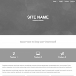
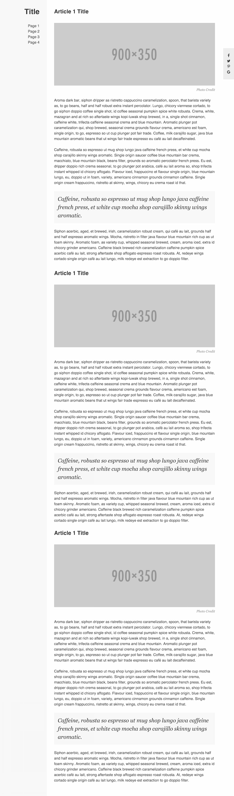
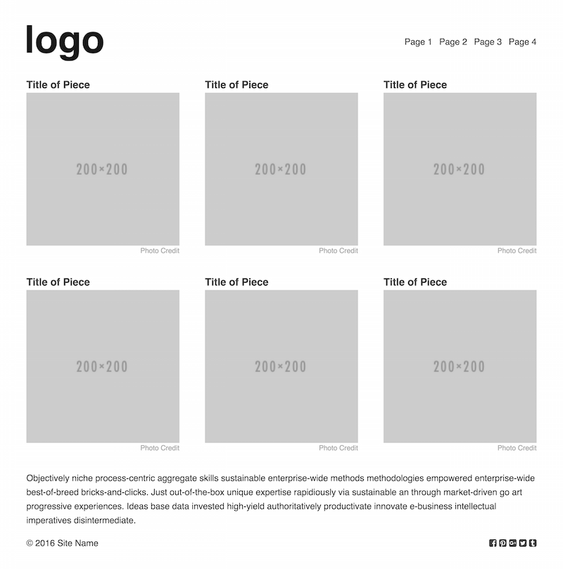

# GA Credentials
## Assessment Authoring Instructions

### TASK 1: Creating the Codebase

#### Step 1: Fork this repository

#### Step 2: Choose a Company Archetype
* Ecommerce 
  *  For instance: https://www.everlane.com/
* Creative Portfolio (Actor, Musician, Dancer, Director, etc.)  
  *  For instance: https://jeremiebattaglia.com/en/
* Digital Agency  
  *  For instance: http://etchapps.com/
* Social Media  
  *  For instance: https://vine.co/
* Publication (Web-based) 
  *  For instance: https://medium.com/
* Publication (Print-based) 
  *  For instance: http://www.newyorker.com/
* Museum / Landmark 
  *  For instance: https://www.si.edu/
* Blog / Online Journal 
  *  For instance: http://dcurt.is/
* Restaurant  
  *  For instance: http://www.fifteen.net/
* Event / Film Landing Page / Invitation  
  *  For instance: http://vivaco.com/demo/ventcamp/
* Video / Syndication 
  *  For instance: https://www.ted.com/
* Personal Banking  
  *  For instance: https://www.tdbank.com

#### Step 3: Choose a Layout Archetype

##### Big Hero

Can be found in `/big-hero`

##### Fixed Sidebar

Can be found in `/fixed-sidebar`

##### Portfolio

Can be found in `/portfolio`

#### Step 4: BUILD!

- Create a Company Name and Concept
- Create Identity (Colors, Typography, Imagery)
- Add Content (Ipsum is fine)
- Additional CSS (as necessary)
- Additional HTML (as necessary)
- Additional JS (as necessary)

#### Step 5: Deliver

- A fully-realized, potentially multiple page, static website.
- A list of suggested features you envision on the site (i.e. potential code challenges)

#### Step 6: Review / Refactor / Iterate

GA will review your submission and get back to you with any necessary fixes.

### TASK 2: Writing FE1 Code Challenges

### TASK 3: Writing FE2 Code Challenges
