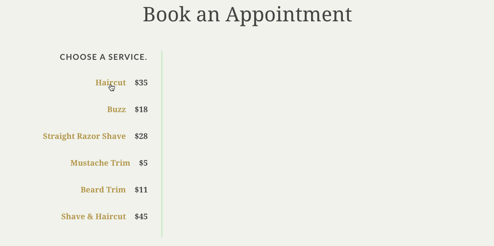

# Proper Barber Shop

## Interactive Booking Form

### Instructions

Proper Barber Shop wants you to build an interactive booking form. 

The simple form would allow a user to select a service and stylist and enter their contact information to book an appointment. 

The team’s designer has provided you with the following visualization:

### What to Code

When the page first loads, only the first step of the form will be showing.

When the user selects a service, you will need to:

- Remove the "selected" class from any other services that might have been previously selected.
- Provide visual feedback that the service has been selected by adding the "selected" class.
- Fade in the "Choose a stylist" step.

When the user selects a stylist, you will need to:

- Remove the "selected" class from any other stylists that might have been previously selected.
- Provide visual feedback that the stylist has been selected by adding the "selected" class.
- Fade in the "Enter your info" step.

When the user tabs or clicks out of a form field:

- Check to see if the user has entered a value. If the field is empty, add an .error class to the field and insert a "required" message after the input (see below).
- If the field is the phone number field or email field, check to see if the value the user entered is a valid format. If the format is invalid, add the .error class to the field and insert an "invalid format" message after the input (see below).

Required message:

    
This is a required field.

Invalid format message:

    
Please enter a valid format.

